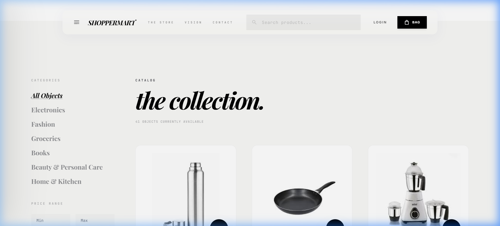
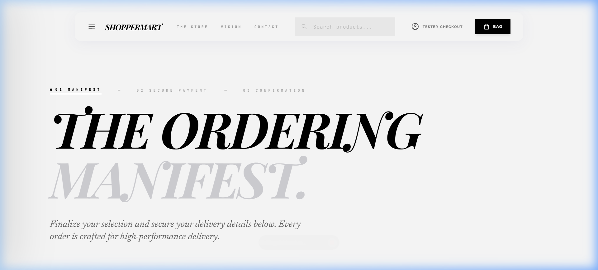

# 🛒 ShopperMart  

  
  
  
  
  

---

## ✨ Overview  
**ShopperMart** is a **Django-based e-commerce platform** where users can:  
- 👤 Register & manage profiles  
- 📦 Browse & manage products  
- 🛒 Add products to cart & checkout  
- 📑 Track orders  
- 🎨 Enjoy a clean responsive UI with Bootstrap 5 & custom CSS  

It’s designed for **learning + production-ready deployment**.  

---

## 📂 Project Structure  

ShopperMart/
│── media/ # Uploaded media (avatars, product images)
│ ├── avatars/
│ └── products/
│
│── ShopperMart/ # Main Django project
│ ├── init.py
│ ├── asgi.py
│ ├── settings.py
│ ├── urls.py
│ └── wsgi.py
│
│── ShopperMartapp/ # Core Django app
│ ├── admin.py
│ ├── apps.py
│ ├── forms.py
│ ├── models.py
│ ├── signals.py
│ ├── urls.py
│ ├── views.py
│ ├── templatetags/
│ └── migrations/
│
│── static/ # Static files
│ ├── css/
│ │ └── style.css
│ └── images/
│
│── templates/ # Templates
│ ├── account/
│ ├── auth/
│ ├── registration/
│ ├── base.html
│ └── ShopperMartapp/ # App Templates
│
│── .env # Environment variables
│── render.yaml # Infrastructure as Code
│── manage.py
│── requirements.txt

---

## 🚀 Features & Technical Highlights

✅ **Advanced Authentication**: Google Single Sign-On (OAuth 2.0) and custom User Models.
✅ **Secure Payment Gateway**: Real-time integration with the official Razorpay SDK handling encrypted tokens, callback webhooks, and cryptographic signature verification.
✅ **Shopping Cart & Inventory**: Atomic database transactions to prevent race conditions during high-concurrency checkouts, with live inventory stock management.
✅ **Responsive Design**: Mobile-first, desktop-optimized UI using raw CSS and Bootstrap 5 utilities, featuring dynamic scroll-drawers and hardware-accelerated animations.
✅ **Production Infrastructure**: Hosted on Render with PostgreSQL, utilizing WhiteNoise for high-speed static asset compression and caching.

---

## ⚙️ Installation & Setup  

Clone the repository 👇  

git clone https://github.com/PranayaKD/ShopperMart.git
cd ShopperMart

Create and activate a virtual environment 👇

python -m venv venv
venv\Scripts\activate   # On Windows
source venv/bin/activate  # On macOS/Linux

Install dependencies 👇

pip install -r requirements.txt

Apply migrations 👇

python manage.py migrate

Create a superuser 👇

python manage.py createsuperuser

Run the server 👇

python manage.py runserver

Open in browser 👉 http://127.0.0.1:8000/

🌐 Deployment

Live at: [shoppermart-hiem.onrender.com](https://shoppermart-hiem.onrender.com) (Deployed on Render)

Procfile

web: gunicorn ShopperMart.wsgi

Build Command

pip install -r requirements.txt && python manage.py migrate && python manage.py collectstatic --noinput

Start Command

gunicorn ShopperMart.wsgi

## 🖼️ Application Showcase
- **Home Page Hero**:

- **High-Converting Product Grid**:

- **Secure Razorpay Checkout**:

## 🛠️ Tech Stack

**Backend System:** Django 5.2 🐍 Python 3.11  
**Database Architecture:** PostgreSQL 🗄️ (Production) | SQLite (Development)  
**High-Performance Serving:** Gunicorn | WhiteNoise (Compressed Static Asset Pipeline)  
**Payment Gateway:** Razorpay SDK (Cryptographic Webhooks)  
**Authentication:** Django-Allauth (Google OAuth)  
**Frontend Aesthetics:** Vanilla CSS3 | Bootstrap 5 Utilities | OSM Autocomplete JS  
**Deployment & Ops:** Render (Infrastructure as Code via render.yaml) ☁️

🤝 Contributing

Fork this repo

Create a new branch: git checkout -b feature-name

Commit changes: git commit -m "Add feature XYZ"

Push: git push origin feature-name

Open a Pull Request 🚀

📜 License

Licensed under the MIT License – free to use, modify, and distribute.

👨‍💻 Author

[Pranaya Kumar Dash](https://pranayakd.in)
📧 Email: dashpranaya28@gmail.com

🔗 [GitHub](https://github.com/PranayaKD) | [LinkedIn](https://linkedin.com/in/pranayakd28)

 
---

👉 This file should be saved as **`README.md`** in your project root (`ShopperMart/`).  

Do you also want me to give you the **`.gitignore`** (specific for Django + VS Code + Python) so your repo stays clean on GitHub?

